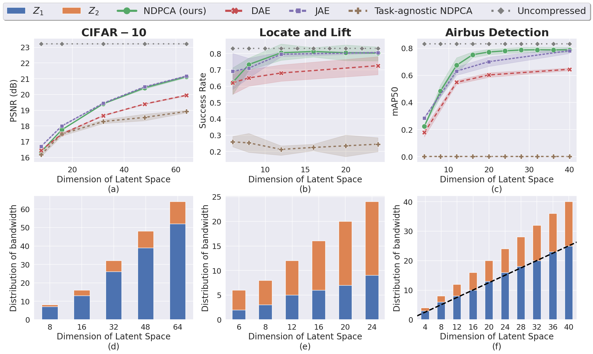

# dtac-dev
The is the repo of Distributed Task-Aware Compression (dtac). 

Link to paper: [Task-aware Distributed Source Coding under Dynamic Bandwidth](https://arxiv.org/abs/2106.06882)
## Table of Contents
- [Introduction](#introduction)
- [Results](#results)
- [Installation](#installation)
  - [Packages](#packages)
  - [Dataset](#dataset)
  - [Usage](#usage)
- [Citation](#citation)

## Introduction
**TLDR**: \
We design a distributed compression framework which learns low-rank task representations and efficiently distributes bandwidth among sensors to provide a trade-off between performance and bandwidth.

## Results

**Top:** Performance Comparison for 3 different tasks. Our method achieves equal or higher performance than other methods. 
**Bottom:** Distribution of total available bandwidth (latent space) among the two views for NDPCA (ours). The unequal allocation highlights the difference in the importance of the views for a given task.


## Installation
### Packages
For the installation of the required packages, see the [setup.py](setup.py) file or simply run the following command to install the required packages in [requirements.txt](requirements.txt):
```bash
pip install -r requirements.txt
```

Then to activate the dtac environment, run:
```bash
pip install -e .
```

### Dataset
#### Locate and lift
The locate and lift experiment needs the gym package and mujoco. To install mujoco, see [install mujoco](https://github.com/openai/mujoco-py).

#### Airbus
The airbus experiment needs the airbus dataset. To download the dataset, see [Airbus Aircraft Detection](https://www.kaggle.com/datasets/airbusgeo/airbus-aircrafts-sample-dataset). \
After downloading the dataset, place the dataset in the "./airbus_dataset
 folder and run "./airbus_scripts/aircraft-detection-with-yolov8.ipynb". \
Then, Put the output of the notebook in the following folder
"./airbus_dataset/224x224_overlap28_percent0.3_/train" and "./airbus_dataset/224x224_overlap28_percent0.3_/val".

### Usage

#### dtac package
The dtac package contains the following models:
* ClassDAE.py: Class of Autoencoders
* DPCA_torch.py: Fuctions of DPCA

and other common utility functions.

#### Locate and lift
To train an RL agent, run the following command:
```bash
python train_behavior_cloning_lift.py -v
```
where -v is the views of the agent: "side", "arm", or "2image".

To train the lift and locate NDPCA, run the following command:
```bash
python train_awaDAE.py -args
```
See the -args examples in the main function of [train_awaDAE.py](PnP_scripts/train_awaDAE.py) file.

To evaluate autoencoder models, run the following command in the "./PnP_scripts" folder:
```bash
python eval_DAE.py -args
```
See the -args examples in the main function of [eval_DAE.py](PnP_scripts/eval_DAE.py) file.

#### Airbus
To train the object detection (Yolo) model, run the following command:
```bash
python airbus_scripts/yolov1_train_detector.py
```

To train the Airbus NDPCA, run the following command in the "./airbus_scripts" folder:
```bash
python train_od_awaAE.py -args
```
See the -args examples in the main function of [train_od_awaAE.py](airbus_scripts/train_od_awaAE.py) file.

To evaluate autoencoder models, run the following command in the "./airbus_scripts" folder:
```bash
python dpca_od_awaDAE.py -args
```
See the -args examples in the main function of [dpca_od_awaDAE.py](airbus_scripts/dpca_od_awaDAE.py) file.

## Citation
If you find this repo useful, please cite our paper:
```

```